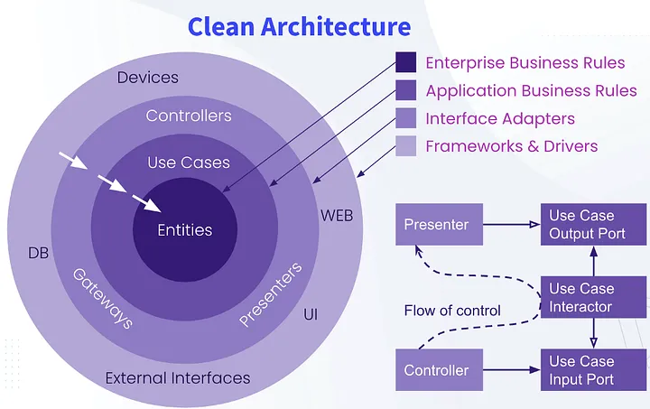
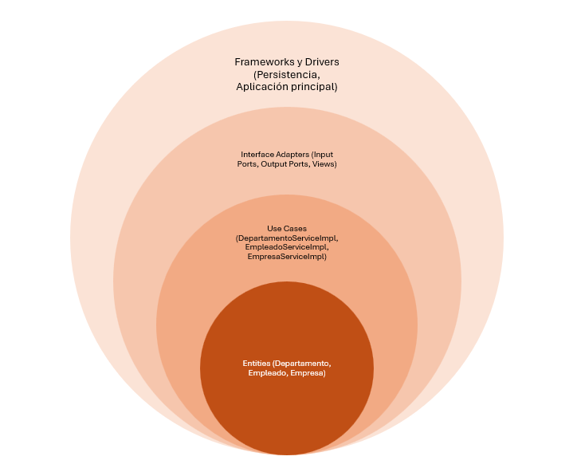

# DBExample

## Descripción
DBExample es un proyecto Java que utiliza Jakarta EE 9.1, Hibernate ORM y MySQL para demostrar operaciones básicas de base de datos.

## Requisitos previos
- Java Development Kit (JDK) 17 o superior
- Maven 3.6 o superior
- MySQL Server

## Dependencias principales
- Jakarta EE API 9.1.0
- Jakarta WS RS API 3.0.0
- MySQL Connector Java 8.0.27
- Hibernate ORM 6.2.13.Final
- Jakarta Persistence API 3.1.0

## Configuración
1. Clona el repositorio:
   ```
   git clone https://github.com/tu-usuario/DBExample.git
   cd DBExample
   ```

2. Asegúrate de tener MySQL instalado y en funcionamiento con una base de datos llamada `db`.

3. Configura tus credenciales de base de datos en el archivo de configuración apropiado (por ejemplo, `src/main/resources/META-INF/persistence.xml` para JPA).

4. Compila el proyecto:
   ```
   mvn clean compile
   ```

## Ejecución
Para ejecutar el proyecto, utiliza el siguiente comando:
```
mvn exec:java
```

La clase principal del proyecto es `com.ugm.dbexample.DBExample`.

## Construcción
Para construir el proyecto y generar un archivo WAR, ejecuta:
```
mvn clean package
```

El archivo WAR se generará en el directorio `target/`.

## Notas adicionales
- Este proyecto utiliza Java 17. Asegúrate de tener la versión correcta de JDK instalada.
- El proyecto está configurado para utilizar la codificación UTF-8.
- Se ha configurado el `maven-war-plugin` para generar un archivo WAR sin necesidad de un archivo `web.xml`.

### Arquitectura del proyecto.

¿Qué es arquitectura limpia? [Link](https://semihtekin.medium.com/what-is-the-clean-architecture-c80c2a2ff69a)



Se implementa arquitectura limpia a modo de ejemplo.



Se usan puertos para comunicar las diferentes capas:

- Input para comunicar las vistas, y casos de uso.
- Output para comunicar la capa de persistencia con los casos de uso.

Cross al proyecto hay utilidades y excepciones para mejorar la detección de errores.

El uso de JPA e Hibernate nos permite abstraernos de la implementación de la base de datos al usar dicho ORM.

¿Qué es JPA? [Link](https://www.tutorialspoint.com/es/jpa/jpa_orm_components.htm)

¿Qué es hibernate? [Link](https://hibernate.org/orm/)

## Contribuir
Si deseas contribuir al proyecto, por favor:
1. Haz un fork del repositorio
2. Crea una nueva rama para tu funcionalidad
3. Realiza tus cambios y haz commit
4. Envía un pull request

## Licencia
Este proyecto está licenciado bajo la GNU General Public License v3.0 (GPLv3).

## Contacto
